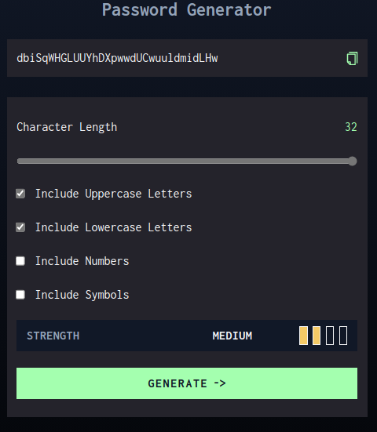
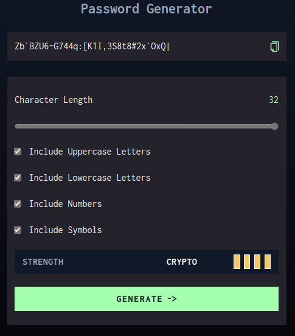

# Password Generator App

This is a simple password generator app that generates a random password. The user can select the length of the password (8-32 characters), and include lowercase, uppercase, numeric, and/or special characters. The app will then generate a random password based on the user's selections.

#### [Click here to view live project](https://password-generator-app-sable.vercel.app/)

#### Screenshot

  </img>
  </img>
  </img>
  </img>

#### Technologies used:

- [T3 Stack](https://create-t3-app-docs.vercel.app/en/introduction): Tailwind CSS and TypeScript only
- [React](https://react.dev/)
- [NextJS](https://nextjs.org/docs/getting-started)
- [random](https://www.npmjs.com/package/random) npm library

This is a challenge from [frontendmentor](https://www.frontendmentor.io/challenges/password-generator-app-Mr8CLycqjh).

**Here is the challenge brief:**

Your challenge is to build out this password generator app and get it looking as close to the design as possible. Sketch and Figma files are provided.

You can use any tools you like to help you complete the challenge. So if you've got something you'd like to practice, feel free to give it a go.

Your users should be able to:

-Generate a password based on the selected inclusion options
-Copy the generated password to the computer's clipboard
-See a strength rating for their generated password
-View the optimal layout for the interface depending on their device's screen size
-See hover and focus states for all interactive elements on the page
